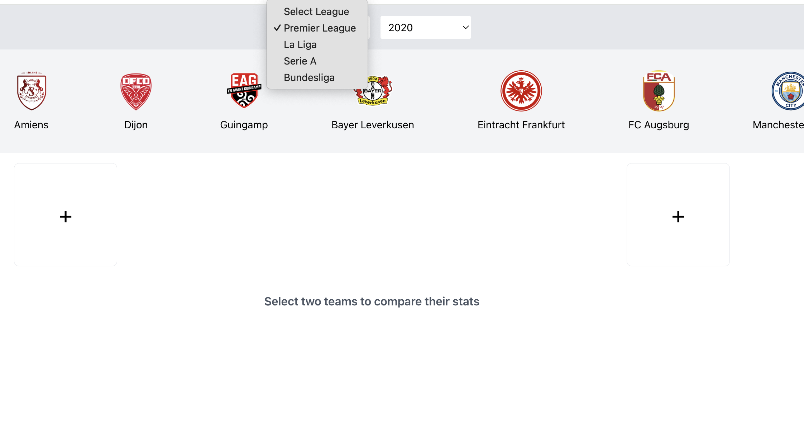

# Football Team Comparison App

This project allows users to compare football teams' statistics across different leagues and seasons. It retrieves data from the [API-Football](https://www.api-football.com/documentation-v3) via RapidAPI and presents the comparison of various metrics such as wins, losses, goals scored, and goals conceded.

## Table of Contents

- [Overview](#overview)
- [Features](#features)
- [Technologies](#technologies)
- [Screenshots](#screenshots)
- [Installation](#installation)
- [Backend Setup](#backend-setup)
- [Frontend Setup](#frontend-setup)

## Overview

The Football Team Comparison App provides an intuitive UI for users to compare teams based on their performance across different leagues and seasons. Users can select a league, season, and teams, and compare them based on key metrics.

## Features

- Select a football league and season.
- Compare two teams based on key statistics: total games played, wins, draws, losses, goals for, and goals against.
- Visually compare team performance with comparison bars.
- Responsive and user-friendly interface.

## Technologies

- **Frontend**: React.js, Tailwind CSS, Recharts
- **Backend**: Node.js, Express, Sequelize ORM, PostgreSQL
- **API**: API-Football (via RapidAPI)
- **Environment Variables**: `.env` for managing API keys

## Screenshots

### Home Page


### Team Comparison



## Installation

Follow these steps to set up the project locally.

### Prerequisites

Make sure you have the following installed on your system:

- Node.js (version 14.x or higher)
- PostgreSQL (version 12.x or higher)

## Backend Setup

1. **Clone the repository**:

    ```bash
    git clone <this project link>
    cd <this-project-name>
    ```

2. **Install backend dependencies**:

    Navigate to the `server` directory and install the dependencies:

    ```bash
    cd server
    npm install
    ```

3. **Create PostgreSQL Database**:

    Set up a PostgreSQL database for the project. You can use `pgAdmin` or any PostgreSQL client to create the database.

    Example:

    ```sql
    CREATE DATABASE football;
    ```

4. **Configure environment variables**:

    Create a `.env` file in the `server` directory and add the following:

    ```env
    RAPIDAPI_KEY=your-rapidapi-key
    DB_USERNAME=your_db_username
    DB_PASSWORD=your_db_password
    DB_HOST=localhost
    DB_PORT=54322
    DB_DATABASE=football_db
    ```

5. **Run database migrations**:

    Sync the Sequelize models with the PostgreSQL database:

    ```bash
    npm run sync-db
    ```

6. **Start the backend server**:

    ```bash
    npm start
    ```

    The server will start at `http://localhost:5001`.

## Frontend Setup

1. **Install frontend dependencies**:

    Navigate to the `client` directory and install the dependencies:

    ```bash
    cd client
    npm install
    ```

2. **Configure environment variables**:

    Create a `.env` file in the `client` directory and add the following:

    ```env
    REACT_APP_API_URL=http://localhost:3001
    ```

3. **Start the frontend server**:

    ```bash
    npm start
    ```

    The frontend will start at `http://localhost:3001`. If the default port is in use, you will be prompted to use another port.

## Usage

1. Open your browser and go to `http://localhost:3001`.
2. Select a league and season from the dropdown menus.
3. Click on the team logos to compare the statistics of two teams.
